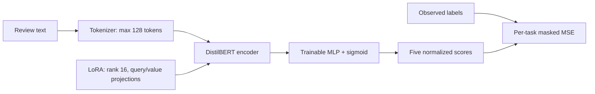
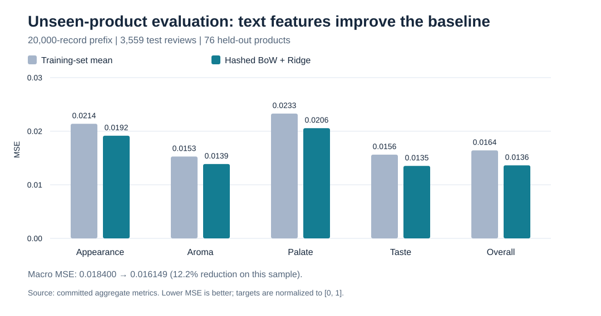
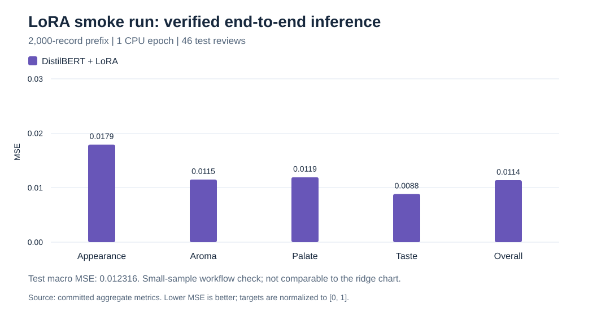

# Multi-Aspect Review Scoring with DistilBERT + LoRA

**One review → five continuous ratings, with product-held-out evaluation and verified model recovery.**

This project predicts **appearance, aroma, palate, taste and overall** scores from beer-review text. It combines a shared DistilBERT encoder with LoRA adapters and a regression head, then makes the experiment inspectable through explicit data contracts, baselines, saved metrics and serving-bundle checks.

**Team lead: Ashley Liu (Xinying Liu).** Ashley led the original team project and completed most of the implementation. See [attribution](docs/ATTRIBUTION.md) for the distinction between original work and the subsequent AI-assisted engineering extension.

| Evidence | Recorded result |
|---|---|
| Product-held-out baseline experiment | **12.2% lower macro MSE** than the training-mean predictor on 3,559 test reviews |
| New LoRA training run | One CPU epoch; training, export, reload and prediction completed |
| Verification | **13 tests passed**, including all three neural tests |
| Reusable artifacts | Aggregate metrics, synthetic demo, model loaders and reproducible chart script |

[Results](#experimental-results) · [Architecture](#architecture) · [Quick start](#quick-start) · [Technical report](docs/REPORT.md)

## Problem and engineering decisions

A single sentiment label loses information: the same review can praise aroma while criticizing taste. A shared encoder predicts all five aspects, using normalized targets in **[0, 1]** and a separate loss mask for each observed rating.

The reliability work addresses three concrete failure modes in the source experiment:

| Failure mode | Implemented change |
|---|---|
| Missing ratings were converted to zero | Invalid labels remain absent and are excluded from loss and metrics per target |
| Record-level partitions could share products | Stable product hashes assign each product to exactly one train/validation/test partition |
| The saved adapter omitted the regression head | The new serving bundle explicitly saves adapter, head, tokenizer and base-model reference; reload predictions are checked |

Normalized exact review duplicates are removed before partitioning. Product identifiers are used for splitting, not as text-model input. Labels such as `13/20` become `0.65`; plain numbers must already be normalized. MSE and MAE are reported per target, with observed-label counts.

## Architecture



LoRA adapts the attention query/value projections with rank 16, scaling 32 and dropout 0.1. The regression head remains outside the PEFT-wrapped encoder so it stays trainable. Its output is a rating estimate, not a confidence probability.

The baseline uses 128 deterministic signed bag-of-words features, per-review normalization and one ridge regressor per aspect. The intercept is unpenalized; regularization is chosen using validation macro MSE.

## Experimental results

The two new experiments below use **different source prefixes and test partitions**. Each answers a different question; their MSE values do not establish a LoRA-versus-ridge ranking.

### 1. Does review text improve prediction on unseen products?

**Protocol:** first 20,000 source records; seed 42; product-based hash partitioning; exact-review deduplication; alpha selected from `0.1`, `1`, `10` using validation only. Selected alpha: **10**.

| Partition | Reviews | Products |
|---|---:|---:|
| Train | 15,054 | 630 |
| Validation | 1,310 | 72 |
| Test | 3,559 | 76 |

Cleaning excluded 47 invalid rows and 30 duplicate reviews. All five labels were observed in these test rows.



| Aspect | Mean baseline MSE | Ridge MSE | Ridge MAE |
|---|---:|---:|---:|
| Appearance | 0.02139 | **0.01916** | 0.10903 |
| Aroma | 0.01528 | **0.01387** | 0.08968 |
| Palate | 0.02329 | **0.02056** | 0.11518 |
| Taste | 0.01563 | **0.01353** | 0.08853 |
| Overall | 0.01642 | **0.01363** | 0.08919 |
| **Macro MSE** | **0.018400** | **0.016149** | — |

Ridge reduced macro MSE by **12.2% relative to the training-mean baseline** on this sample. A paired product-cluster bootstrap with 300 resamples gives an exploratory 95% interval of **[−0.003865, −0.001470]** for the MSE difference, ridge minus mean. Negative values favor ridge.

The interval accounts for clustering within test products, conditional on the fitted models. It does not include training uncertainty or remove source-order sampling bias. [Full metrics, validation trials, input digest and environment](results/product-holdout/metrics.json).

### 2. Can the new LoRA model train, export and serve correctly?

**Protocol:** first 2,000 source records; seed 42; product-based split; one CPU training epoch; batch size 8. Removing one duplicate left **1,693 training / 260 validation / 46 test reviews**.



| Aspect | Test MSE | Test MAE |
|---|---:|---:|
| Appearance | 0.01792 | 0.12055 |
| Aroma | 0.01150 | 0.08555 |
| Palate | 0.01193 | 0.07816 |
| Taste | 0.00885 | 0.07981 |
| Overall | 0.01138 | 0.08587 |

**Validation macro MSE: 0.026721. Test macro MSE: 0.012316.** Validation and test contain different products; the lower test value is not evidence of improvement during training. A single epoch also provides no basis for a convergence curve.

The exported bundle reloaded with matching predictions, and the prediction CLI returned all five scores. The **46-row test set is a workflow check**, not a strong generalization benchmark. [Saved metrics](results/lora-smoke/metrics.json) · [Recorded dependency versions](results/lora-smoke/environment.json).

Example output from that trained bundle:

```json
{
  "appearance": 0.67638,
  "aroma": 0.63378,
  "palate": 0.59472,
  "taste": 0.61721,
  "overall": 0.63991
}
```

Input: `Floral aroma with a smooth texture and balanced finish`.

### Historical experiment provenance

The original TF-IDF/LoRA result text is preserved as [historical evidence](results/historical/reported_mse.txt). It lacks a complete checkpoint/split association and is excluded from the new comparison plots.

The original step-12,000 checkpoint records approximately **0.1824 epochs** and contains 24 adapter tensors, with **no regression-head tensors**. The new serving-bundle implementation addresses this gap; it does not recover the old model's exact predictions. [Checkpoint audit](results/historical/checkpoint_audit.json).

## Quick start

### Run a self-contained demo

Python 3.10+ and NumPy are sufficient:

```bash
python -m pip install -r requirements.txt
python -m reviewscore predict --model examples/synthetic-baseline.json --text "Bright floral aroma with a smooth finish"
python -m reviewscore benchmark --data examples/synthetic.jsonl --out runs/demo --limit 200
```

The bundled demo model is **ridge trained on artificial templated examples**. It demonstrates input, output and serialization; its accuracy is not real-world evidence. Trained LoRA weights remain in ignored local `runs/` directories and are not distributed here.

### Reproduce an evaluation on local data

```bash
python -m reviewscore benchmark --data /path/to/ratebeer.json --limit 20000 --split product --out runs/product-holdout
```

Input contains one JSON object or Python-literal dictionary per line, with `review/text`, `beer/beerId` and optional `review/{aspect}` fields. The reader uses `ast.literal_eval`, never `eval`. Large JSON arrays are unsupported; convert them to JSONL first. Obtain the source data independently under its applicable terms. No original reviews, usernames or product identifiers are bundled.

### Train and use a LoRA serving bundle

```bash
python -m pip install -r requirements-neural.txt
python -m reviewscore.train_neural --data /path/to/ratebeer.json --base distilbert-base-uncased --out runs/lora --limit 2000 --epochs 1 --batch-size 8 --device cpu
python -m reviewscore.predict_neural --bundle runs/lora/bundle --text "Floral aroma with a smooth texture and balanced finish"
```

Use a local base directory and `--local-only` for offline training. A Hub model ID may download the pretrained base. CPU is the default; CUDA/MPS is opt-in. Output directories must be empty so results from different runs cannot mix. On Windows, [`validate-lora.ps1`](validate-lora.ps1) automates dependency setup, tests and a smoke run; its dataset default reflects the original local setup.

### Check and regenerate results

```bash
python -m unittest discover -s tests -v
python scripts/render_results.py
```

All **13 tests passed** in the configured environment, covering parsing, missing-label handling, partition overlap, metric validity, bootstrap behavior, baseline serialization, neural gradients, head trainability and offline bundle recovery. GitHub Actions is configured; its hosted status should be checked separately. [Validation record](docs/VALIDATION.md).

## Scope and next experiment

Current results use ordered prefixes of the source corpus. Product grouping prevents product overlap but does not remove reviewer overlap, near duplicates or every source of distribution leakage. Hash partitioning gives approximate proportions rather than balanced row counts.

The next model-quality experiment is to evaluate LoRA and ridge on **the same larger, fixed partitions**, with validation-only model selection and a paired product-cluster comparison. Full-corpus sampling, reviewer-held-out stress tests, rank/sequence-length ablations and serving latency remain future work.

## Repository guide

| Path | Contents |
|---|---|
| [`reviewscore/`](reviewscore/) | Data contract, baseline CLI, optional neural training/inference and checkpoint audit |
| [`results/`](results/) | Aggregate results and historical evidence |
| [`examples/`](examples/) | Synthetic demo input and baseline artifact |
| [`tests/`](tests/) | Pipeline and neural verification |
| [`legacy/`](legacy/) | Original model and baseline source |
| [`docs/REPORT.md`](docs/REPORT.md) | Technical report and experimental limitations |
| [`docs/ATTRIBUTION.md`](docs/ATTRIBUTION.md) | Team authorship and extension scope |

No blanket project license has been assigned. Third-party data and libraries retain their applicable terms.
